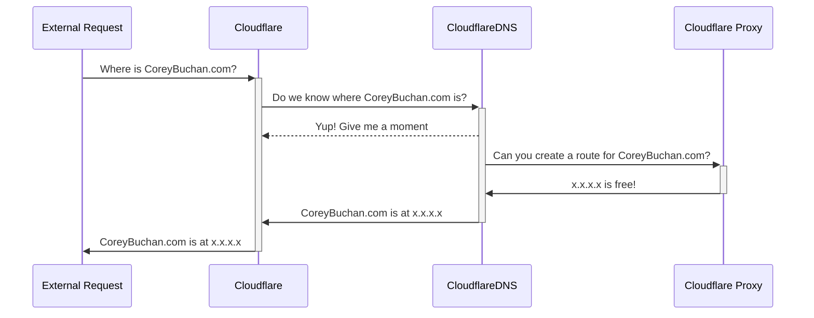
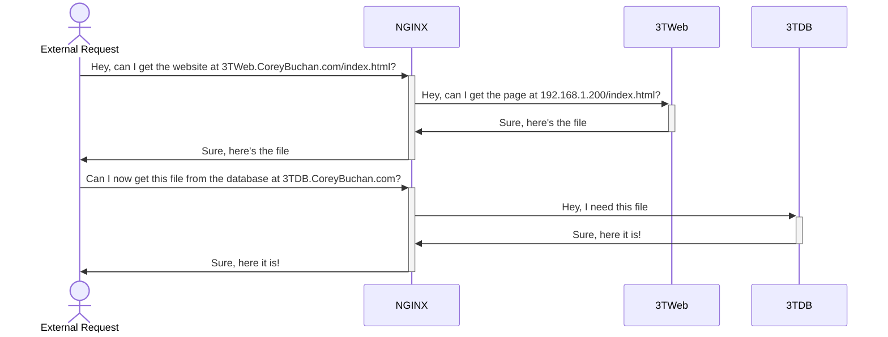

DNS Proxy Diagram


Home Server Architecture
```mermaidJS
%Cant use this because its in beta!%
architecture-beta

    group homenet(cloud)[Home Network]

  

    service router(database)[Router] in homenet

    service homeother(database)[Other home devices] in homenet

  

    junction hnjunction in homenet

  

    router:B -- T:homeother

  

    group homelab(cloud)[Home Lab]

  

    service pc(server)[Naberius] in homelab

    service nginx(internet)[NGINX] in homelab

    service ddns(internet)[Cloudflare DDNS] in homelab

    service portainer(server)[Portainer] in homelab

    service 3tdb(disk)[Database] in homelab

    service 3tweb(internet)[Website] in homelab

  

    junction hlJunctionCenter in homelab

  

    router:R -- L:pc

    pc:R -- L:nginx

    nginx:T <-- B:ddns

    nginx:R -- L:hlJunctionCenter

  

    hlJunctionCenter:R -- L:portainer

    hlJunctionCenter:T -- B:3tdb

    hlJunctionCenter:B -- T:3tweb

  

    group cloudflare(cloud)[Cloudflare]

  

    service dns(database)[Cloudflare DNS] in cloudflare

    service proxy(internet)[Cloudflare Proxy] in cloudflare

  

    junction dnsJunction in cloudflare

  

    dns:R -- L:proxy

    proxy:R -- L:router

    dns:T <-- B:dnsJunction

    dnsJunction:L -- R:ddns

  

    service external(cloud)[External request]

    external:R -- L:dns
```

NGINX Sequence Diagram

