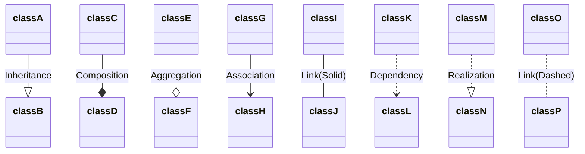

# What is Data

- Anything you can see and record; any raw fact.
    - Number of entrances/exits in a room
    - color of walls
    - number of students in a course
    - etc.

# Information

- Information in processed data
- Information from one step can be raw data for another

# Database Model

- A blueprint we will eventually use to build a database

## Logical Model

- Free of an implementation or technical details
- Platform agnostic
- We’re trying to make categories that are related to each other

## Physical Model

- More details and less conceptual
- Addresses how to store data **efficiently** and **easy to retrieve**

## Data Model

- Represents the data used and created by your system
- **people, places, things, or events** about which information is captured and, potentially, stored.
- A commonly used modeling technique is Entity Relationship Modeling

## Entity Relationship Modeling

- A **customer** is related to the **payment information**, but those are 2 pieces of data.
- Customer data might be
    - Age
    - Gender
    - Address
- Despite being different data, they are **related.**
- The ERD model will have a bunch of Category Names
- Each Category has a list of characteristics
- Above the dashed line is an ID,
- Lines between categories show the relationships
    - Each line has 2 symbols
    - Symbols closest to the entities are called “Cardinalities”
        - | means “Singular relation”
            - 3 spread out lines(Crows Foot) “multiple relation”
            - Customer | —— [spread lines] Order
                - A Customer[Singular} can place [multiple] Order
    - Symbols between the Cardinalities are called Modalities
        - a line before the spread means “required”
        - a circle means “optional”
- When reading, assume you’re discussing a singular when starting, then modify the reading based on the lines.
- “Business Rules” define how categories are related to each other, and the notation expresses those rules.
    - Are communicated by the relationships that the categories share and the **nature of those relationships**

# Elements of an [[Entity Relationship Diagram]]

- Textbook shows “Crows Foot Notation”
- An Entity, any category of data we’re interested in, is represented by a box
    - Named with Noun Expressions
    - Every entity must have an identifier
    - Represent something we have multiple instances of, e.g., many customers or items.
    - Only the relevant attributes to the system/process should be included in the diagram
    - **Naming conventions are important** to reduce confusion and increase clarity.
## Relationships
- 3 types:
    - 1 to Many
        - the 1 side is called the Parent
        - the Many side if called the Child
    - 1 to 1
    - Many to Many
- This tells you “How many instances of 1 entity can be related to another” on each side of the relationship.
    - A student can take many courses
    - A course can be taken by many students
- One to Many is the most common

## Modality

- Appears in-between the Cardinality symbols
    - a | means Required
    - a 0 means optional

# Data Dictionary
- Names a piece of metadata and describes it.

# Metadata
- Data about the data
    - Size, type, who last edited, etc.
    - Is also part of the data store.
- Safeguards the database by improper/unformatted data from being entered
# Process of data modeling
1. Detect entities and relationships
    - You will likely make new entities as you look through the data, and then need to reviews those entities and their relationships
2. Specify the **Cardinality** of the relationship
    - 1:1
    - 1:M
    - M:M
3. Specify the **Modality** of each relationship to to each entity
4. Break down M:M into 1:M relationships using an **Intersection/Bridge Entity**
    1. An Intersection Entity breaks down a M:M relationship into two 1:M relationships
    2. It represents a single instance of the relationship between Entity A and B
5. Add attributes and assign identifiers
# Independent Entity

- Can exist without the help of another entity
- Another object in the real world
- They have identifiers created from their own attributes
    - e.g. A student exists without a Course Registration, but a Course Registration requires a student to exist/be created
# Dependent Entity
- When a child requires attributes from the parent to be uniquely identified.
- Its identifier requires at least one attributes from the parent.
- Shown as a box with double border lines.

# UML
- Shows the structure of a system
	- Attributes
	- Operations
	- Relationships between objects
	- Language agnostic
## Visibility
- `+` represents public
- `#` represents protected
- `-` represents private
- Underlined text means static
- italic means abstract
- << interface >> should be placed above an interface definition
- Dependency
	- "A uses {something from} B"
	- A calls a function of B
	```mermaid
	classDiagram
		B <.. A
	```
- Association
	- "Has a"
	- Whenever you save an instance of B into a variable in A
	- Encapsulates Composition and Aggregation
	- With no arrows, its bi-directional
	```mermaid
	classDiagram
		B <-- A
		C -- D
	```

- If no multiplicity is stated, assume 1-1

- Inheritance
	- A is a child of B
	```mermaid
	classDiagram
	B <|-- A
	```

- Implementation
	- Specifically for interfaces
	- B implements A
	```mermaid
	classDiagram
	B..|>A
	```
