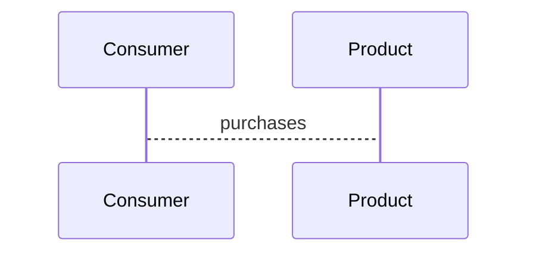
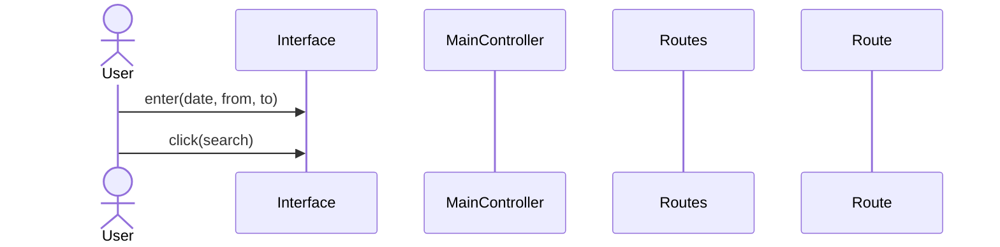

- A [[UML]]
- Solid box represents a Subject
- Solid vertical line represents "lifeline"
- dashed horizontal line represents function calls

```mermaid
sequenceDiagram
	Consumer --> Product: purchases
```

```mermaid
sequenceDiagram
	actor User
	participant Interface
	participant MainController
	participant Routes
	participant Route
	User ->> Interface: enter(date, from, to)
	User ->> Interface: click(search)
```
