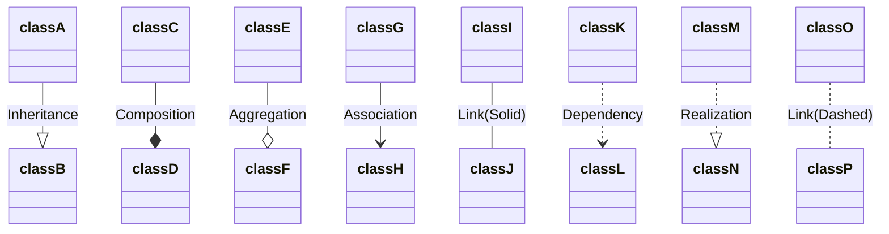

- Shows the structure of a system
	- Attributes
	- Operations
	- Relationships between objects
	- Language agnostic
## Visibility
- `+` represents public
- `#` represents protected
- `-` represents private
- Underlined text means static
- italic means abstract
- << interface >> should be placed above an interface definition
- Dependency
	- "A uses {something from} B"
	- A calls a function of B
	```mermaid
	classDiagram
		B <.. A
	```
- Association
	- "Has a"
	- Whenever you save an instance of B into a variable in A
	- Encapsulates Composition and Aggregation
	- With no arrows, its bi-directional
	```mermaid
	classDiagram
		B <-- A
		C -- D
	```

- If no multiplicity is stated, assume 1-1

- Inheritance
	- A is a child of B
	```mermaid
	classDiagram
	B <|-- A
	```

- Implementation
	- Specifically for interfaces
	- B implements A
	```mermaid
	classDiagram
	B..|>A
	```
