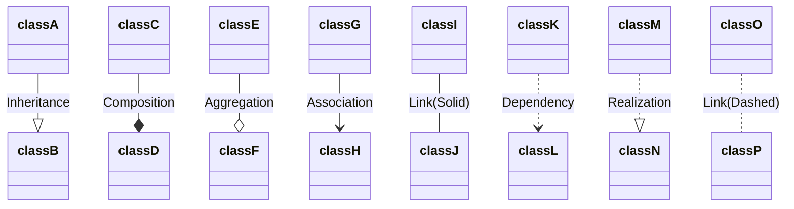

---
tags:
  - Python
---
# Inheritance
 - Basically the same as Java, but with **multiple inheritance**
 - Child class is called a Subclass
 - Parent class is called a Superclass
```python
# Subclass inherits from Superclass
class Subclass(Superclass): 
	
```
- You can extend all basic data types, since they're secretly objects
- Access parent functions with `super().parentFunc()`

# Interface

## Informal Interfaces

### Duck Typing
- If a object has the required properties of another object, then we can call it that object
- e.g. If an object can be concatenated, indexes, and converted to ASCII, then we can treat it like a string
- We can validate the type if we want `if type(a) == BaseClass:...`
- Goes hand in hand with Structural typing
### Protocols
- Analogous to interfaces in Java
- e.g. the "Sized" protocol required you so have `__len__(self)` implemented

## Formal Interfaces
- More rigidly defined than Informal interfaces
### Abstract Base Classes (ABCs)
- An incomplete class
- A set of methods and properties that a class must implement if it wants to be considered a duck-type instance of that class


# Typing
## Nominal
- The NAME should be the same
## Structural
- The internal structure should be the same
- same variables, methods, etc.

## Comparing
```
class 2dPoint {int x, int y}
class XyObject {int x, int y}
```
- In Nominal typing(Java/c++), these are different objects, and you cant use them interchangeably.
- In Structural typing(Python), we can use these interchangeably because we can access the same variables inside the class.

# UML
- Shows the structure of a system
	- Attributes
	- Operations
	- Relationships between objects
	- Language agnostic
## Visibility
- `+` represents public
- `#` represents protected
- `-` represents private
- Underlined text means static
- italic means abstract
- << interface >> should be placed above an interface definition
- Dependency
	- "A uses {something from} B"
	- A calls a function of B
	```mermaid
	classDiagram
		B <.. A
	```
- Association
	- "Has a"
	- Whenever you save an instance of B into a variable in A
	- Encapsulates Composition and Aggregation
	- With no arrows, its bi-directional
	```mermaid
	classDiagram
		B <-- A
		C -- D
	```

- If no multiplicity is stated, assume 1-1

- Inheritance
	- A is a child of B
	```mermaid
	classDiagram
	B <|-- A
	```

- Implementation
	- Specifically for interfaces
	- B implements A
	```mermaid
	classDiagram
	B..|>A
	```
